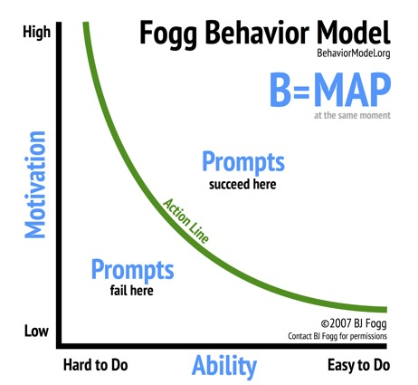

## Fogg's Model of Persuasion

Next week, we'll be talking about persuasion. A simple model that will help you to understand how to think about this is a [behavioral model described by BJ Fogg](http://mebook.se/images/page_file/38/Fogg%20Behavior%20Model.pdf).

Someone who is highly **motivated** and presented with an action they find **relatively easy to do** is more likely to be successful.

Also consider that users perform behaviors in response to a signal or cue. Fogg illustrates this with a third element in the model called the **prompt** (aka trigger/cue). Thus you need all three ingredients in persuasive design.

Fogg gives a great example of motivation, ability, and [prompts here](https://www.behaviormodel.org/prompts.html), but consider.... FaceBook sends regular messages in email to draw us to their platform. Mine says something like, "Lisa, check out what Strathmore is posting!" Right away, I see my name and someone or some group that I follow. I recall the first time I saw this thinking it might be a personal message. Clearly, it is not. But repeated messages of this nature work as a prompt to create an action -- click to read updates. How persuasive do you find emails like this?
