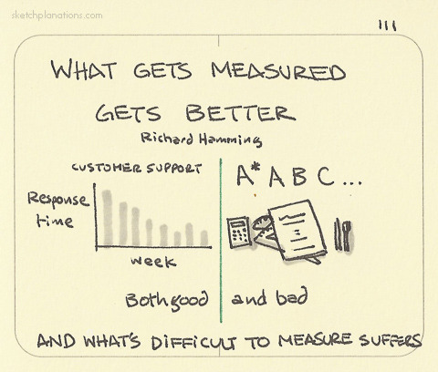

## Evaluating the Effectiveness of your Design

It's not enough to have confidence that your idea is good -- you need some way to measure success. And **to measure something, it needs to be something you can count**.

So, for example, you can count things such as:
- clicks
- task completion
- page views
- form responses
- subscriptions
- ratings
- reduction in complaints/errors
- shares

While we haven't talked much about A/B testing, your behavioral objective and design represents an *implicit hypothesis* that you can improve an outcome by affecting user behavior.

If you were to implement your concept, behavioral evidence is much stronger than the evidence you provided in terms of theory. And your plan to test and analyze results will affect how your stakeholder views your idea.
