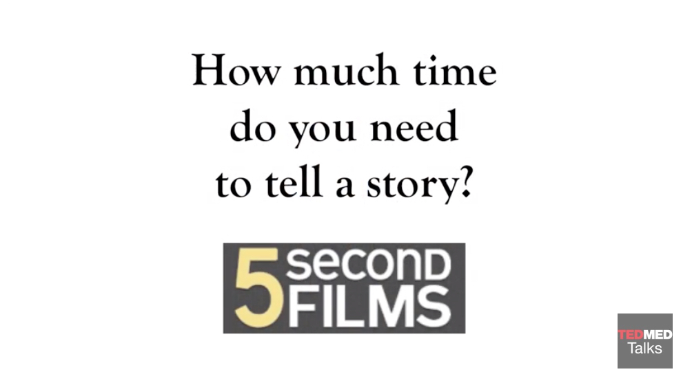

## What Makes a Good Story?

Thoughts and ideas from this lab come from "Let the Story Do the Work: The Art of Storytelling for Business Success" by Esther K. Choi.

Though we've talked about the importance of storytelling for engagement, persuasiveness, memorability, and cohesion -- the reality is they also convey your ideas and values in such a way to make you stand out in a crowd.

Elements of a story have:
- A beginning, middle, and end
- Hero, challenge, journey, change, resolution and call to action
- Authenticity
- And a spark -- emotional, imaginative -- something that charge that motivates

This last bit is important... because as you may recall, it is emotion that guides decision-making.

Highlight your central objective and don't clutter it un-necessarily. As mentioned earlier, you can use a hook to draw in your audience. For example, something that is counter-intuitive, conflicting, or surprising.

There are a limited number of plots. Choi describes five basic plots:
- **Origin story**. How things began. Perhaps, how a service, business, or product began.
- **Rags to Riches**. A story of humble beginnings to dramatic success.
- **Re-birth**. (Figurative) near death to redemption.
- **Overcoming the monster**. A fight for survival where something bad is vanquished.
- **The quest**. Leaving status quo to embark on a quest. Choi gives an example: "James Dyson went through over five thousand prototypes of his cyclone-based vacuum cleaner before he developed the first successful model. Still, no manufacturing company in the US and UK was initially willing to license his product.18 Today, Dyson the company returns over $500 million in annual profits and employs nearly seven thousand people worldwide. Had the founder given up on his quest for a “bagless” vacuum cleaner, Dyson would be just another name." (p. 32)

In addition to plot, Choi also talks about a *theme*. For example, a theme could be empowering customer service representatives, improving quality of life, promoting eduction.

Below, Randy Olson (author of "Houston, we have a narrative") gives a succinct talk on narrative structure using the simple idea of "and but therefore."

