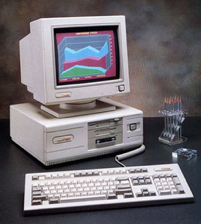

+++?image=template/img/bg/black.jpg&position=top&size=100% 12%
@title[SUS Usablity Scale]

@snap[north text-white span-100]
@size[1.0em](SUS Usability Scale)
@snapend

@snap[south-west span-50 text-black]
@ul[list-content-verbose](false)
- "Quick-and-dirty" measure of usability
- Single score ranging from 0-100

@ulend
@snapend

@snap[east fragment span-100 text-top]
@img[span-60](assets/sus-scale.jpg)
@snapend

@snap[south-east fragment span-80 text-top]
@img[span-60](assets/sus-score.jpg)
@snapend

@snap[south-east template-note text-grey fragment]
https://measuringu.com/sus/
@snapend

+++?image=template/img/bg/black.jpg&position=top&size=100% 12%

@title[Does it always hurt to be positive?]

@snap[north text-white span-100]
Does it always hurt to be positive?
@snapend

@snap[west span-50 text-06 text-black text-top]
Sauro and Lewis (2011) questioned the advantage of having a mix of negative and positive questions.
  
@ul[list-content-verbose](false)
- Is there "acquiescence response bias" (tendency to agree)?
- What about extreme responses?
- Do respondents make mistakes?
@ulend
@snapend

@snap[midpoint]
@img[split-screen-img span-60 fragment](assets/thermometer.jpg)
@snapend

@snap[east span-90 fragment]
@img[split-screen-img span-60 fragment](assets/results.jpg)
@snapend

@snap[south span-90 fragment template-note text-grey text-left]
Sauro, J., & Lewis, J. R. (2011, May). When designing usability questionnaires, does it hurt to be positive? In Proceedings of the SIGCHI Conference on Human Factors in Computing Systems (pp. 2215-2224). ACM.
@snapend
