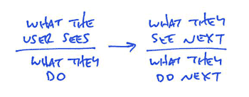

# Task Flows, UI Flows, and User Decision-Making

This week our focus is understanding interaction. Humans have innate processes for managing social coordination and we'll look closely at this. In particular, our focus is on dialogue and how we coordinate messages during interaction, as well as take steps to avoid mis-communications as well as diagnose and resolve potential error. You do this expertly without recognizing the complexity behind your actions! But as a designer, you need to think hard about how to coordinate user action as well as guide them them through a decision process.

You may already be familiar with creating task flows to track the a user's progress through a given task. The idea of "ui-flows" (below) or "wireflows" are another way to think of a user journey from the perspective of what a user sees and what they do. In other words, this is a tool for you to think about the points at which a user has a decision.

Here are couple of articles on this topic:
- [UX Planet - UX Glossary: Task Flows, User Flows, Flowcharts and some new-ish stuff](UX Glossary: Task Flows, User Flows, Flowcharts and some new-ish stuff)
- [SignalvNoise - A shorthand for designing UI flows](https://signalvnoise.com/posts/1926-a-shorthand-for-designing-ui-flows)

And, finally, a short article on [micro-interactions from UXDesign.cc](https://uxdesign.cc/micro-interactions-why-when-and-how-to-use-them-to-boost-the-ux-17094b3baaa0). Micro-interactions are also interactive elements in your design that bear close consideration.

Micro-interactions are an intriguing concept. We've talked a bit about the habit loop and will return to it when we talk about persuasive design. Micro-interactions are gestural interactions that participate in communicative processes but also are activated by a trigger and are intrinsically rewarding!

Take a look at the article. Sometimes the value is less in what you say, than in how you say it. 
