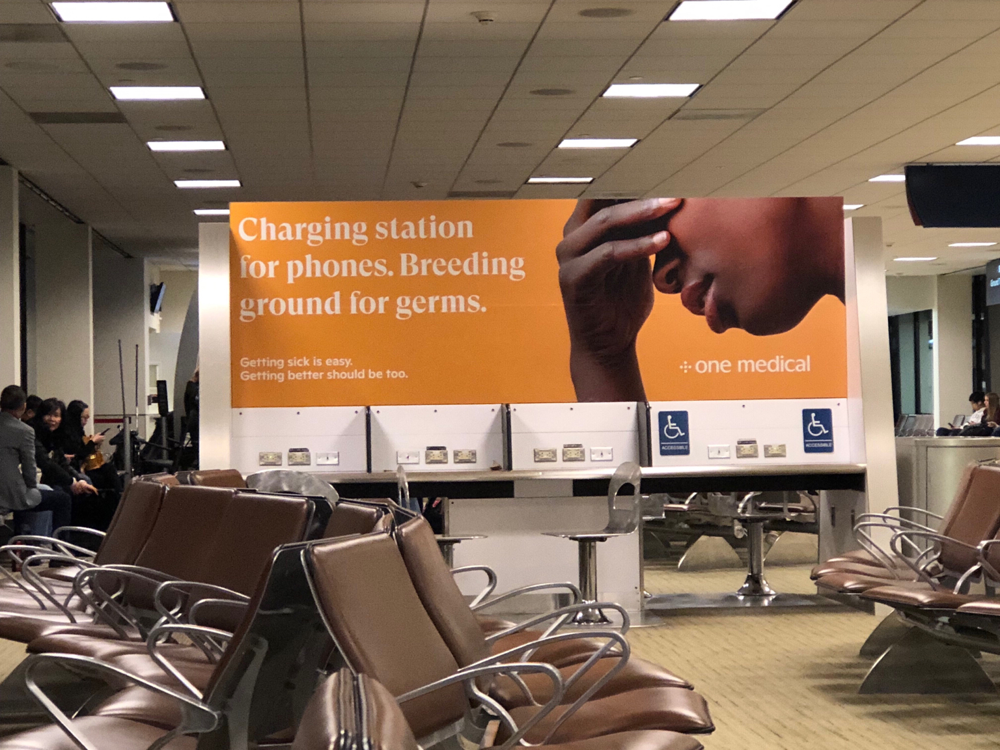

# TouchPoints

When you think about a user journey, imagine it crossing through space and time. These days, space is both virtual and physical. At UB, for example, you may both see posted flyers and virtual announcements referring to the same event on the University website. These are touchpoints --  **interactions between user and media along a user journey meeting a need at a given time and place**. Generally, touchpoints refer to  points of contact you have in engaging a user over *channels* (e.g., social networks, website, email) and at different points along their user journey.

If you are a designer promoting an event around community action, then you know your engagement does not stop at getting someone's attention for a few seconds. You want discourse over time so that you can develop a conversation, build awareness and interest -- hopefully, culminating in a decision to act.

There are many articles about UX and touchpoints online. This is one from Adaptive Path called ["Un-sucking the Touchpoint"](https://adaptivepath.org/ideas/un-sucking-the-touchpoint/) and this is another from Gianluca Brugnoli - a  designer at Frog Design and entitled ["Touchpoints Matrix"](Gianluca Brugnoli -teacher at Politecnico di Milano and designer at Frog Design).

Though not specifically about touchpoints, here is a moment that could have probably been designed better (at least for "One Medical"). A woman sitting next to me in the airport asked if I thought the outlets were working at the "germ station."

